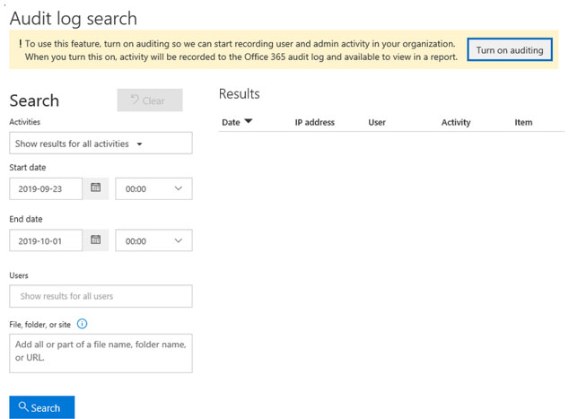

.. _prerequisites:

Office 365 integration prerequisites
====================================

.. contents:: :local:

In this article, you will learn which prerequisites need to be configured on your Safetica Management Server and Azure tenant for the Safetica Office 365 integration to work correctly.

The steps described below need to be performed by all users who haven’t yet configured the Safetica Office 365 integration or who are setting up a new tenant. Also, if you are experiencing issues with Safetica Office 365 integration, please check these settings before contacting Safetica Support.

Three areas need to be checked and configured:

Allow PowerShell Basic Authentication
^^^^^^^^^^^^^^^^^^^^^^^^^^^^^^^^^^^^^^^^
Safetica uses PowerShell commands to communicate with Microsoft Graph API. Graph API, however, only supports PowerShell Basic Authentication method: https://office365.uservoice.com/forums/264636-general/suggestions/20570782

From security perspective, we are not happy about this, and we intend to change the authentication method as soon as Microsoft enables us to do so. In the meantime, you can use the following commands to turn on Basic Authentication on your Safetica Management Server machine:

.. code-block::
   
   Command prompt
   winrm set winrm/config/client/auth @{Basic=”true”}

   PowerShell
   winrm set winrm/config/client/auth ‘@{Basic=”true”}’

Turn on Azure audit logging
^^^^^^^^^^^^^^^^^^^^^^^^^^^^^^
Before you can start setting up your Safetica Office 365 integration, you must turn on audit logging in your Azure tenant. In the past, it used to be enabled by default, so existing Safetica users with configured Office 365 integration have this setting enabled already. New users or users with new Azure tenants, however, must turn this configuration on manually. To turn on Azure audit logging, use the Security & Compliance Center and perform the following steps

#. Visit https://protection.office.com.
#. In the Security & Compliance Center, go to **Search** > **Audit log search**. You will see a banner informing you that auditing must be turned on to record user and administrator activity.
#. Click Turn on auditing.

If you do not see the banner with the **Turn on auditing** button, it means you have audit logging enabled and do not need to take any further actions.

Audit logging can also be turned on via a PowerShell command:

#. `Connect to Exchange Online PowerShell <https://docs.microsoft.com/en-us/powershell/exchange/exchange-online/connect-to-exchange-online-powershell/connect-to-exchange-online-powershell?view=exchange-ps>`_.
#. Run the following PowerShell command:

.. code-block:: ruby
   
   Set-AdminAuditLogConfig -UnifiedAuditLogIngestionEnabled $true

Please note that applying these changes in Azure tenant might take some time. We recommend waiting a few hours before contacting Safetica Support with issues.

Disable Microsoft security defaults
^^^^^^^^^^^^^^^^^^^^^^^^^^^^^^^^^^^^^^

From October 22th, 2019, Microsoft sets `security defaults <https://docs.microsoft.com/en-us/azure/active-directory/fundamentals/concept-fundamentals-security-defaults>`_ for newly created Azure tenants to Enabled by default. This setting, however, blocks all unknown connections including Safetica. For Safetica Office 365 integration to work correctly, you need to disable security defaults for your tenant:

#. Sign in to the `Azure portal <https://portal.azure.com>`_ as a security administrator, conditional access administrator, or global administrator.
#. Go to **Azure Active Directory** > **Properties**.
#. Click **Manage security defaults**.
#. Set the **Enable security defaults** option to **No**.
#. Click **Save**.

This setting does not compromise security, it just allows your Azure tenant to communicate with third parties.

Please note that applying these changes in Azure tenant might take some time. We recommend waiting a few hours before contacting Safetica Support with issues.

After you perform these three steps, you can start configuring Safetica Office 365 integration in the desktop Safetica Management Console.